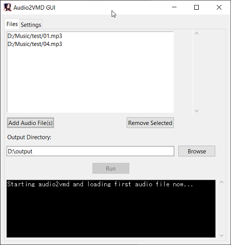

# audio2vmd (v16)
Completely automatically convert audio to vmd lips data using python cmd/automatic batch-file, with automatic vocals extraction. Using this, you can make your MMD models lip-sync to any song or speech audio. 


# Features
- **Automatic Audio to VMD conversion**
  - Automatically creates a lip-synced VMD for MikuMikuDance/MikuMikuMoving from a audio file
- **One-click installer**
  - One-click installer batch file to easily install audio2vmd on your computer (this may need more development)
- **Optional GUI**
  - Fast and simple GUI interface to select audio files, change the settings of the config file, and run conversions
- **Audio file types**
  - Likely accepts all major audio file types for conversion. Will automatically convert them into wav files for this program and for MMD uses
- **Audio extraction from videos**
  - Can also accept video files such as mp4 or mkv as input, and will automatically extract the audio from them for conversion
- **Voice detection and seperation**
  - Automatically detects vocals from songs/background sounds and seperates the vocals to a wav file before conversion
- **Spilting long audio**
  - Automatically splits audio if it's longer than 5 mintues(based on config settings), while also avoiding to cut audio in the middle of talking. This allows you to not worry about the 20,000 frames limit of MMD.
- **Optimized lips frames**
  - Automatically calulate and delete unneeded frames to make the filesize much smaller and allow you to load longer files into MMD
- **Batch Processing**
  - Can accept multiple audio files at once and convert them all each to a different vmd file
- **Config file**
  - Simple config file allows you to change settings. Currently you can change the effect of the amount for each vowel (A, I, O, U) to make talking much more pronounced, as well as the spliting duration and if to use optimization.
- **Send VMD lips data**
  - Can optionally send the created VMD lips data to another VMD file. Using this, you can send the VMD lips directly to a VMD containing things such as an body animations. 
- **Ready for MMD**
  - Will automatically convert audio to wav format if it isn't in wav already. Combined with the VMD, they're ready to launch with MMD/MMM.(This won't move/delete your original audio)

# Requirements
- Windows 10 or higher (It's possible this may work on other Operating Systems, but was only designed for windows)  
- 4GB RAM recommended (it may work with less RAM as well)  
 
# Installing audio2vmd
## Install automatically using 1-click installer batch file
1) Download and install [Python 3.10.6](https://www.python.org/downloads/release/python-3106/)  
   - Check the 'Add Python 3.10 to PATH' box [during installation](audio2vmd/img/pathbox.jpg)
2) Download latest version of [audio2vmd](https://github.com/EliseWindbloom/audio2vmd/archive/refs/heads/main.zip)
3) Unzip audio2vmd and run "install.bat" (Do not run as admin) to install automatically, this may take awhile to download all the required files.
   - For an additional speed boost, try installing audio2vmd on an SSD (if you have one) instead of a Hard Disk Drive.

## Installing manually 
If you would like to manually install it instead, follow these steps: 
Download/install [Python 3.10.6](https://www.python.org/downloads/release/python-3106/) and [FFmpeg](https://github.com/BtbN/FFmpeg-Builds/releases) and add them both to system PATH. Also make sure you have [Microsoft Visual C++ Redistributable](https://aka.ms/vs/17/release/vc_redist.x64.exe) installed on your pc.  
Then run these commands in command line to install:  
```
git clone https://github.com/EliseWindbloom/audio2vmd.git
cd audio2vmd
cd audio2vmd
python -m venv venv
call venv\Scripts\activate.bat
pip install torch==2.5.1+cpu torchvision==0.20.1+cpu torchaudio==2.5.1+cpu --index-url https://download.pytorch.org/whl/cpu
pip install openunmix==1.3.0 numpy==1.26.3 scipy==1.14.1 pyyaml==6.0.1 pydub==0.25.1 PyYAML==6.0.1 tqdm==4.66.4 psutil==6.0.0
cd..
```

## Uninstalling
To uninstall, simply delete the "audio2vmd" folder
 - (Optional) if you don't want FFmpeg (a video/audio processing tool) available for your system, delete the "C:\Program Files\FFmpeg" folder to uninstall ffmpeg.
 - (Optional) if you don't want python on your system, run the python installer again and choose the remove option to uninstall python.

# Usage
**You have two ways you can easily use audio2vmd:**
  - Drag & drop audio files into the "Audio to VMD" bat file to convert them to lipsynced vmd files. This will also accept mp4/mkv video files.
    
  - Double-click on "Audio to VMD" bat file to launch the GUI where you can easily select audio files, run batch conversions and change settings. This will also accept mp4/mkv video files.

**Alternatively, you can call it with command-line from the vitural environment:**  
- Using audio2vmd.py for command-line usage:  
  ```python
  cd audio2vmd  
  call venv\Scripts\activate.bat
  python audio2vmd.py input_audio.mp3
  ````
  - To convert mulitple files at once:  
  `python audio2vmd.py input1.mp3 input2.mp3 --output "C:\files\vmd\"` 

  - You can also give audio2vmd.py a plain textfile containing a list of audio files to convert(have one file path on each line):  
    `python audio2vmd.py list_of_audio_files.txt --output "C:\files\vmd\"`
    
  - You can optinally add the output folder and name of model the vmd is for as well:  
    `python audio2vmd.py mysong.mp4 --output "C:\files\vmd\" --model "My Model Name"`
    
  - You can also edit the **audio2vmd\config.yaml** file in a text editor to edit a few of the settings.
    
- Using audio2vmd_gui.py to use the simple GUI:  
  ```python
  cd audio2vmd  
  call venv\Scripts\activate.bat
  python audio2vmd_gui.py
  ```

## GUI Preview / Video Demonstration
- Video: "[audio2vmd demonstration](https://vimeo.com/989158449)"
  


## New features in version 16
  - **Optimizations, huge speed improvement and lowering of system requirements**
  - Replaced spleeter(which uses tensorflow) with openunmix to reduce memory usage/increase cpu optimization
  - Huge speed boost, was over twice as fast when testing it (an audio file that took 1min6secs to convert, now takes about 31seconds to convert)
  - Significant code optimization to reduce memory usage without messing up the vmd output
  - Should no longer require a paging file or a lot of memory to use
  - "Separate Vocals" setting added to audio2vmd.py along with GUI and config file:
    - Can be set to "automatic", "always", or "never" to choose how audio2vmd separates vocal files.
    - 'automatic' = detect and separate if needed
    - 'always' = skip detection and always separate all audio files
    - 'never' = skip detection and assume file is already vocals-only
    - "automatic" is recommended if any of your files have music/background noise, otherwise "never" is recommended for a additional big speed boost.

#### Versions 14 & 15 were for research and were developmental

#### New features in version 13
  - Improved error handling and improved installer
  - removed unneeded imports from audio2vmd
  - created gui launcher
#### New features in version 13.2
  - Added automatic ffmpeg install to installer (installs automatically if not found on system)
  - Improved the GUI launcher to hopefully make it much better at launching without issue
#### New features in version 13.3
  - Added tooltips display for GUI settings tab
#### New features in version 13.4/13.5
  - Fixed bug where there was double code in audio2vmd.py
  - Possible minor reduced memory usage
#### New features in version 12
  - Special Characters handling - should be able to handle non-english file paths much better now.
  - The "Run" becomes a "Force Stop" button after clicking on it. Click on "Force Stop" to force the app to stop processing the audio/vmd files.
  - Extras Tab - This lets you do extra operations without needing a audio file:
    - Optimize most any VMD containing lips/face/dance data (new options added to gui/config file for this)
    - Send lips data straight from one VMD file to another VMD file.
  - One at a time GUI - The gui now process batch list audio files one at a time (without using audio2vmd_gui.py's restart ability), which seems to reduce the memory requirements when running a batch of audio files.
#### New in version 12.1
  - GUI's "Browse" remembers file paths - the GUI browse option now remembers the file directories of chosen files and will reopen from their folder (can also open from the selected audio file's folder).
#### New in version 12.2
  - Improved "Force Stop" button to help make sure it stops the process correctly when you click on it. (It may give error message(s) due to forcefully stopping it, but it should work fine again if you press "Run" an extra time.)
  - Model Name added to config file and GUI settings tab. 
  
## Credits
Nawota for the c# Lipsync plugin that this project is loosely based on.  
This repository was first inspired by the original automatic lipsync guide by [Vayanis](https://www.youtube.com/watch?v=ozKBYGiyPJE)  
[Parse VMD in python guide by crossous](https://www.jianshu.com/p/ae312fb53fc3)  
[nuekaze](https://github.com/nuekaze/VMD-motion-extract/tree/master) for unpacking/repacking VMD python code (though as csv format)  
[VMD file format wiki](https://mikumikudance.fandom.com/wiki/VMD_file_format)  
